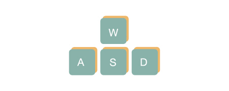
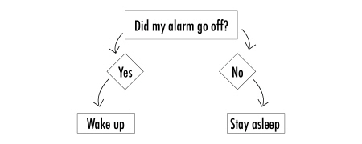

# Remote Control

<font size =3> Now that you understand drive commands, you can write your own remote control! First, import the Zumi library and create the object before you begin. </font>

### Import libraries


```python 
from zumi.zumi import Zumi

zumi = Zumi()
````

***
# Remote Control

## User input
<font size =3> To make a remote control, you need a way to register your input and translate it to motor commands. Python includes a function <font face="Courier">input()</font> that reads the keyboard input and saves it as a variable. To see how this works, run the following code, type in your name, and hit enter. Any input that you entered will be saved in <font face="Courier">my_name</font>.
</font>


```python 
my_name = ""
print("Hello,",my_name)
````

***
# Remote Control

## Pseudocode
<font size =3> Now that you have all the tools you need, put it together in pseudocode, which is a program that’s written in plain language that a human can understand. Pseudocode is a good way to figure out how your program will work before translating it to Python. One small problem: <font face="Courier">input()</font> can’t read arrow key controls, so your remote control code will be checking for letter inputs "w", "a", "s", and "d". 
Look at the pseudocode below to see what we mean. <br> <br>

<font face="Courier">
get input from user <br>
if input is "w", go forward <br>
if input is "s", reverse <br>
if input is "a", turn left <br>
if input is "d", turn right <br>  
</font>

</font>



***
# Remote Control

## If statements
<font size =3>In the pseudocode, your program will have to instruct Zumi to drive in a particular direction. based on the input. If statements, or **conditionals**, are used to help your program make decisions. You actually use conditionals every day! Some examples might include:


* If my alarm goes off, then I will wake up. Else, I will stay asleep.
* If I am hungry, I will eat something.
* If it's sunny out, I will wear sunscreen.
* If my room is clean, I will get my allowance. Else, I will make no money.


If statements are written like this in Python: <br> <br>

<font face="Courier">
    
if insert condition here: <br>
<span style="margin-left: 40px;">Insert statements here</span> <br>
else: <br>
<span style="margin-left: 40px;">Insert statements here</span> <br>

if alarm goes off:<br>
<span style="margin-left: 40px;">I will wake up</span><br>
else:<br>
<span style="margin-left: 40px;">Stay asleep</span><br>
</font>



***
# Remote Control

The condition is what the computer checks to know if it is true or false.
* If the condition is true, the computer will execute, or carry out, the statements underneath it.
* If the condition is false, the computer will NOT execute the statements underneath it.
* "Else” has no condition! This is because “else” is the last option when using if-else statements.  When a computer reaches the “else” option after checking all the other conditions, then the else condition is automatically true and will run its statements.
* One way to use “else” would be when something needs to happen when a condition is false. When the "if" condition is false and nothing needs to happen, don’t use an “else”.

### Indentation

Indentation is very important in the Python programming language. The indentations indicate which statements belong to a particular section in the code.

You may have noticed that the statements below the if and else statements are indented 4 spaces or one tab space. Even if the indent is off by *one* space, you will get an error! Try to stick to either tabs or spaces, and don't combine the two.

***
# Remote Control

## Comparators
<font size =3> Next, translate your pseudocode to Python code. Before inputting drive commands, use print statements for testing, like this one: <br> <br>
    
<font face="Courier"> 
direction = input("Please enter a command: ")

if direction == "w": <br>
<span style="margin-left: 40px;">print("Go forward")</span> <br>    
</font>
    
The equal sign may look familiar, but in code it has a slightly different application! The <font face="Courier">==</font> sign is an example of a **comparator**. Comparators can be used inside conditions to compare values. If the statement is true, the statement below it will execute. These are comparators:

* \> Greater Than
* \< Less Than
* \>= Greater Than or Equal To
* <= Less Than or Equal To
* == Equal To
* != Not Equal To 

***
# Remote Control

Run the cell below and make some changes to the conditionals to see how these work! If you want, you can change the variable names or the input statements. Make sure to test your code.
</font>


```python 
X = 10
Y = 100
Z = 200

if X != Y:
    print("X is not equal to Y")

if Z > Y:
    print("Z is greater than Y")
````

***
# Remote Control

<font size =3> Now you have all the tools to write out the rest of the missing conditionals. Use if statements, comparators, and print statements to write code for the "s", "a", and "d" keys.


```python 
#TODO Finish the rest of the missing if statements

while True:
    direction = input("Please enter a command: ")

    if direction == "w":
        print("Go forward")
````

<font size =3> Did you notice the code is running forever? Because this is a remote control code, you want to be able to continuously tell Zumi what to do. To do this, you need to use a while loop that runs forever. Currently, the only way to stop the code is by clicking the "stop" icon in the toolbar. To safely quit from this loop, it is better to include an if statement that checks for "q" input to break from the loop. <br> <br>
    

<font face="Courier">
if direction =="q": <br>
<span style="margin-left: 40px;">break</span>
</font>

Add this code to your code above and test that you can exit your code without errors. </font>

## Add drive commands
<font size =3> Now that you have the logic down, add the drive commands with the correct command. Remember you can change the parameters for these controls or choose different keys to customize your remote control! </font>

***

# Extension Activities <br> 


###  Lombard Street <br> <br>
Lombard Street is one of the most crooked streets in San Francisco. What would Zumi need to do to be able to drive down it? Construct your own model of Lombard Street with whatever materials you choose to use. Walls should be used around the street, and Lombard Street itself is at a 27% slope. Next, measure the turn degree of each hairpin turn to emulate on the model. After streets are finished, test it out with your remote code, noting how many degrees you had to turn their Zumi in order to navigate it safely.


