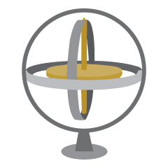
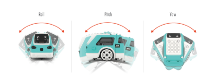
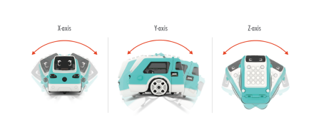
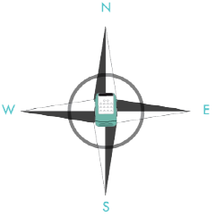
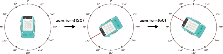

# Gyroscope

<font size =3> When you made your remote control, Zumi turned left or right using the number of degrees that you gave as a parameter. How does Zumi know how many degrees she is turning? Zumi is equipped with an **MPU**, or motion processing unit, and has two very important sensors that are necessary for driving straight and making accurate turns: the **gyroscope** and **accelerometer**. This lesson is about the gyroscope. You’ll learn about the accelerometer later! </font>


## What is a gyroscope?
<font size =3> When you think of a gyroscope, you may be thinking of a mounted, spinning wheel that stays balanced in the same orientation, no matter which direction you turn or flip the gyroscope. How? This can be explained by conservation of momentum. While you may not have heard of this term before, you have experienced this. For example, if you have ever spun around on an office chair, you probably noticed you spin faster when you bring your arms and legs in. Since momentum has to be conserved, your speed increases when you bring your mass (arms and legs) closer to you.
    


In electronics, gyroscopes don't look like this. They are tiny chips that also use motion to detect changes in orientation. For robotics, this device that measures rotation speed. Gyroscopes are important because we need rotation speed to calculate how many degrees Zumi has turned in a given amount of time. <br><br>
</font>

### Import libraries


```python
from zumi.zumi import Zumi
from zumi.util.screen import Screen
import time

zumi = Zumi()
screen = Screen()
```

## Axes
<font size =3> There is more than one axis that you can use to measure rotational speed. The axis you will be most concerned with is yaw, or measuring turns to the left and right. You can also measure if Zumi is tilting forward and backward or tilting left and right. These three axes are called roll, pitch, and yaw.
    


There are three codes below reading all three axes: X, Y, and Z. Run each one and check Zumi's screen to see how the angles are affected. Can you match X, Y, and Z with roll, pitch, and yaw? Make sure you start the code with Zumi flat on the ground before picking her up.</font>

### X-angle


```python
zumi.reset_gyro()
for i in range(0,50):
    current_angle = int(zumi.read_x_angle())
    message = " X-Angle reading           "
    message = message + str(current_angle)
    screen.draw_text(message)
    time.sleep(0.05)
    
print("Done")
screen.draw_text_center("Done")
```

### Y-angle


```python
zumi.reset_gyro()
for i in range(0,50):
    current_angle = int(zumi.read_y_angle())
    message = " Y-Angle reading           "
    message = message + str(current_angle)
    screen.draw_text(message)
    time.sleep(0.05)
    
print("Done")
screen.draw_text_center("Done")
```

### Z-angle


```python
zumi.reset_gyro()
for i in range(0,50):
    current_angle = int(zumi.read_z_angle())
    message = " Z-Angle reading           "
    message = message + str(current_angle)
    screen.draw_text(message)
    time.sleep(0.05)
    
print("Done")
screen.draw_text_center("Done")
```

<font size =3> Based on the data, could you figure out which directions correspond to X, Y, and Z? 


 

For the purposes of driving, you will care the most about the Z-axis, or yaw, of Zumi's gyroscope. Calling <font face="Courier"> zumi.read_z_angle()</font> will return the number of degrees you have turned from when you started your code. You will be using this in later programs. <br>
Here is an example of getting the yaw value using <font face="Courier">read_z_angle()</font>:</font>

### Reset Gyroscope 

<font size=3>You may have noticed a function at the beginning of each code cell <font face="Courier">reset_gyro()</font>. This function will set all angles for roll, pitch, and yaw back to zero. Running <font face="Courier">zumi=Zumi()</font> will always do this for you, but if you ever need to reset your angles later in your program you can use this function. </font>


```python
zumi.reset_gyro() 
for i in range(100):
    z_angle = int(zumi.read_z_angle()) # <-- This function reads the angle
    message = " Z Angle reading        "
    message = message + str(z_angle)
    screen.draw_text(message)
    time.sleep(0.1)
```

## Absolute Angles

<font size=3> In the previous lesson, you made shapes by using **relative** angles. This means that when you call <font face="Courier">zumi.turn_left(30)</font>, for example, Zumi will turn 30 degrees no matter which direction she is currently facing. However, this is not a good way to keep track of our **heading**, or the direction we are pointing. Think about how we use North, South, East, and West to keep ourselves from getting lost. </font>

 

<font size=3> In the previous section you learned that when you call the Zumi object or run <font face="Courier">reset_gyro()</font>, Zumi will reset all gyroscope values to zero. Think of this action as resetting your "North". <br> </font>

### zumi.turn()

<font size=3>You learned about <font face="Courier">zumi.turn_left()</font> and <font face="Courier">zumi.turn_right()</font>, but now it's time to introduce a new function. To use absolute angles, call <font face="Courier">zumi.turn()</font>. See the diagram below to understand how this works: <br><br>

 
    
In this case, 0 degrees is North, 90 degrees is West, 180 degrees is South, and 270 degrees is East. Similarly, -90 degrees is East, -180 degrees is South, and -270 degrees is West. You would use the positive values to turn to the left and negative values to turn to the right. </font>

### Squares with heading
<font size=3> Now with your new knowledge about using absolute heading as you would use a compass to get around the neighborhood, write code for driving in a square that uses the <font face="Courier">turn()</font> function. Imagine you are giving Zumi directions in this way: <br> <br>
    
<font face="Courier">
Go North for 1 block<br>
Go West for 1 block<br>
Go South for 1 block<br>
Go East for 1 block<br>
</font>
    
Use the images above to help you. Hint: Start by going forward then changing your heading by using <font face="Courier">turn()</font>.


```python
# Write Code here
```
