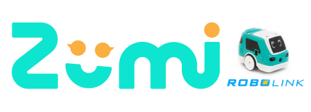
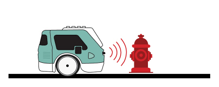

# Obstacle Avoidance (Front IR)

<font size =3> Have you ever been in a car when the emergency auto brakes went on? What happened? How was the car able to tell when to stop? Self-driving cars need to be able to avoid obstacles in an emergency. Instead of infrared, they use more advanced sensors like **LIDAR** (Light Imaging Detection and Ranging) and **RADAR**. LIDAR uses laser light to map out the environment while RADAR uses radio waves. Despite not having this technology, Zumi can still avoid obstacles! </font>



## Import libraries


```python
from zumi.zumi import Zumi
import time

zumi = Zumi()
```

## Stop for Pedestrians
<font size=3> As you saw in the video, it is extremely important for self-driving cars to be able to detect dangers up ahead, especially if they are pedetrians! In this activity, you will code Zumi to drive forward using <font face="Courier">go_straight()</font> until she detects your hand with either the front left or front right IR sensor. now When you take your hand away, Zumi should keep driving.</font>

### Pseudocode
<font size=3> This time, you will be writing the pseudocode for this mission! In the cell below, write each line of pseudocode as a **comment**. You can do this by putting the pound sign (#) at the beginning of the line. The computer will ignore them but they are a great way to organize your code and provide documentation. 


```python
# Write pseudocode in here
```

<font size=3> Once you have your pseudocode, translate each line of code into Python and fill it in the for loop below:


```python
for x in range(300):
    # Write your code here

zumi.stop() # Don't forget to stop at the end!
print("Done!")
```

## Zumi Maze

<font size=3> Collision avoidance is an essential feature in any car, but a self-driving car would have to go around the obstacles. In this section, you will learn about how to change direction if Zumi encounters an obstacle.<br>


For this activity, you will need both of your front IR sensors. This time, instead of stopping and waiting for the obstacle to be removed, you will tell Zumi to turn a little to the left or to the right to go around, depending on which sensor is triggered.</font>

### Initialize heading

<font size=3> In the beginning of the program, set your heading to 0. You can create a variable with a different name, like <font face="Courier">angle</font> or <font face="Courier">direction</font>, but we will use <font face="Courier">heading</font> in this example. The reason you will be using a variable is because your direction will constantly be changing depending on what obstacles get in Zumi's way!<br><br>
    
<font face="Courier">
    heading=0</font>
    
For all of our programs, it is very important to set the heading to zero to make sure you start off going straight!</font>

### Change heading
    
<font size=3>For this mission, your goal is to turn a little to the left if your right sensor is triggered, and a little to the right if your left sensor is triggered. If both sensors are triggered, something is directly in front! Zumi will need to do a complete 180 to avoid what could possible be a dead end. Instead of calling <font face="Courier">turn_left()</font> or <font face="Courier">turn_right()</font>, you will instruct Zumi to change heading by adding or subtracting degrees. For example: <br><br>

<font face="Courier">
if front_right_ir < 100: <br>
<span style="margin-left: 40px;"> heading = heading + 30 </span><br>
    </font>
    
Since the right sensor being triggered means we go **left**, you need to **add** degrees, not subtract. Look back to the lesson gyroscopes if you need help remembering absolute angles.</font>
    
### Pseudocode

<font face="Courier">
set heading to zero<br>
check IR sensors<br>
if front right sensor is triggered, change heading by positive degrees to go left<br>
else if front left sensor is triggered, change heading by negative degrees to go right<br>
else if both sensors are triggered, stop, reverse a little bit, and change heading by 180 (positive or negative)<br>
keep going straight with the new heading<br>
repeat!<br>
</font>

### Logical operators

<font size=3> Before you go into writing your code, notice that the third if statement is checking if both are triggered. In Python, you would use the **and** operator, just like in English! <br><br>
    
<font face="Courier">
if front_right_ir < 100 and front_left_ir < 100: <br>
<span style="margin-left: 40px;"> # Write code here to stop, reverse, and change directions by 180 </span><br>
    </font>
    


```python
# Write out your code here!

heading = 0
zumi.reset_gyro()

for x in range(1000):
    # Statements

zumi.stop()
```
