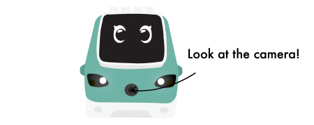
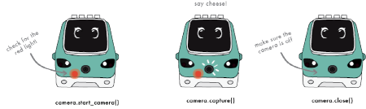
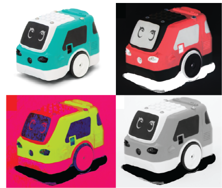
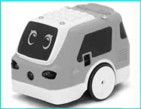
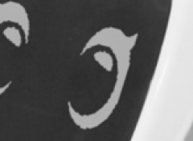

# How does Zumi see?

<font size =3> Self-driving cars need a lot more than just obstacle detection sensors. Human drivers have eyes and ears that help us see potential dangers up ahead that a proximity detector might not be able to detect. We can also tell the different between pedestrians, cyclists, and other cars. What else do self-driving cars need to navigate our world?</font>


## Take a Selfie

<font size =3> First up: use Zumi's camera to take a picture and display it on the screen! </font>



### Import libraries
<font size =3>Pay attention to the new libraries: the camera and vision libraries! These libraries contain code to take, modify, and display images. </font>


```python
from zumi.zumi import Zumi
from zumi.util.screen import Screen
import cv2
import time
from zumi.util.vision import Vision # New library!
from zumi.util.camera import Camera # New library!

zumi = Zumi()
camera = Camera()
screen = Screen()
vision = Vision()
```

<font size =3> Just like taking an actual picture, this code has a countdown so you can be prepared. Run the code, smile, and get ready to see yourself on the Zumi screen!</font>


### Cheese! 📸 


```python
camera.start_camera() # Turn on the camera

print("3...")
screen.draw_text_center("3...")
time.sleep(1)
print("2...")
screen.draw_text_center("2...")
time.sleep(1)
print("1...")
screen.draw_text_center("1...")
time.sleep(1)
screen.draw_text_center("Cheese!")

image = camera.capture() # Take a picture
camera.close() # Make sure to close the camera stream
screen.show_image(image) # Display image on OLED
```

## Displaying Images in Jupyter
<font size =3>Instead of showing your picture on the Zumi screen, display it right here in the Jupyter Notebook. As a bonus, it will appear in color! </font>


```python
camera.start_camera()

print("3...")
screen.draw_text_center("3...")
time.sleep(1)
print("2...")
screen.draw_text_center("2...")
time.sleep(1)
print("1...")
screen.draw_text_center("1...")
time.sleep(1)
screen.draw_text_center("Cheese!")

frame = camera.capture()
camera.close()

camera.show_image(frame)
```

### Camera functions
<font size=3> There are three functions that you need to know for taking pictures with Zumi: <br><br>
    
 
   
Before taking a picture, you will need to turn on the camera with <font face="Courier">start_camera()</font>. You cannot take an image without the camera stream! The red light will indicate the camera is on. Next, use <font face="Courier">capture()</font> to take a picture. Save the picture in a variable to display it later. For example, <br> <br>
    
<font face="Courier">frame = camera.capture()</font>  
<br>
    
Finally, don't forget to turn off the camera! If you don't run <font face="Courier">close()</font> and you try to run <font face="Courier">start_camera()</font> again, you will get an error. If this happens, save and close the notebook to force the camera to turn off.</font>

### Show the image
<font size=3> Zumi doesn't need to "see" the image like we do to process it because all she sees is numbers! To show what we mean, write code below that takes a picture and saves it in a variable, and then print the variable.


```python
# Write code here!
camera.start_camera()
image = camera.capture()
camera.close()

print(image)
```

<font size=3>However, humans need to see the image as pixels of color to understand it. As you saw in the code above,
run <font face="Courier">camera.show_image()</font> to show the image in Jupyter. Remember that this function takes in a parameter to know which image to show. In our example, we saved the image in the variable <font face="Courier">frame</font>. So to show the image we ran: <br> <br>
<font face="Courier">camera.show_image(image)</font></font>  
<br>
    
## Changing Colorspaces
<font size =3> If you have ever played around with Photobooth or another photo editing program, you may have seen some interesting color filters that make your pictures change colors! Depending on the task, seeing the world differently actually helps computers process images faster. Notice that we shortened the variable name <font face="Courier">image</font> to <font face="Courier">img</font> since you will be using this variable a lot!</font>



   
### Grayscale
<font size=3> Grayscale is what we would normally call "black and white". However, this is not really accurate because the image is made up of gray pixels as well. Grayscale pictures are faster to process because there are no other colors. You will be using grayscale images later to scan QR codes!


```python
camera.start_camera()
img = camera.capture()
camera.close()
gray = vision.convert_to_gray(img) # Convert it to gray
camera.show_image(gray)
```

### HSV 
<font size=3> HSV stands for **hue**, **saturation**, and **value**. Even though the image might look strange to you, this colorspace is useful for when Zumi needs to detect or track certain colors. It is more useful than the normal colored image that you are used to seeing because each pixel of information can tell the computer about the color's intensity and whether or not there are shadows. 


```python
camera.start_camera()
img = camera.capture()
camera.close()
hsv = vision.convert_to_hsv(img) # Convert it to HSV, hue saturation and value
camera.show_image(hsv)
```

### Inverted
<font size=3> This one is just for fun! This filter inverts the tones of the color. For example, lighter areas become darker and darker areas become lighter.</font>


```python
camera.start_camera()
frame = camera.capture()
camera.close()
invert = cv2.bitwise_not(frame) # invert the colors
camera.show_image(invert)
```

## Resolution
 <font size =3> You probably noticed that the pictures you displayed on Zumi's screen were not very detailed. That is because the OLED screen is only 128 pixels wide and 64 pixels tall! You've heard us mention pixels before, but let's look at an example. The image on the left is 770 pixels wide and 600 pixels tall. Each pixel is a little square of color. You can't really see them until you zoom in. Look at the eyes more closely on the second image:<br>
<table><tr>
<td>  </td>
<td>    </td>
</tr></table>   

<br> <br>
      

In the second image, you can see the individual pixels. There are 770 of them in one row and 600 in each column! If you had even more pixels, the picture would be considered a **high resolution** image. In contrast, the resolution of the OLED is low. </font>
 
### Changing resolution
<font size=3> Although you cannot change the resolution of the OLED, you can increase the resolution of the images that the camera takes. Run the next cell to take a picture (there is not a countdown this time so be ready!). What do you think the resolution is? Guess how many pixels wide and tall the image is below:


```python
camera.start_camera()
img = camera.capture()
camera.show_image(img)
camera.close()
```

<font size=3>Try changing these values below and watch your image stretch, shrink, and get bigger! Python may round up your pixel values to fit the ratios.


```python
width = 160 # <-- CHANGE ME!
height = 128 # <-- CHANGE ME!

camera = Camera(width,height) # Let the camera know what changes you are making!
camera.start_camera()
img = camera.capture()
camera.close()

camera.show_image(img)
```

<font size =3> There is a size limit! Here we will take a full resolution image. You will notice that Zumi will take more time to process and display the image. Why do you think so?


```python
width = 1296 # Largest resolution!
height = 976

camera = Camera(width,height)
camera.start_camera()
img = camera.capture()
camera.close()

camera.show_image(img)
```

## Video

<font size =3> Although a video looks seamless, a video is actually a series of pictures one after the other. The images are shown so fast that you normally do not notice a difference. However, you may notice the difference here, especially if your images are very large. In order to display a video, take and display pictures inside of a for loop. 
<font size =3>Fill in the code below to show video. Since you will be using a loop, we are going to introduce two new sections of code that will help keep your program from crashing: <font face="Courier">try</font> and <font face="Courier">finally</font>.


```python
camera = Camera()
camera.start_camera()

try:
    for x in range(30):
        # TODO Take a picture
        # TODO show the picture
        camera.clear_output() # Clear the output for the next image to show
finally:
    camera.close()
```

<font size=3> If anything goes wrong or you stop your code while in the <font face="Courier">try</font> section, the program will automatically jump to the <font face="Courier">finally</font> statements. In this case, we put a <font face="Courier">close()</font> for the camera so that you never have to worry about it staying on. </font>
    
    
